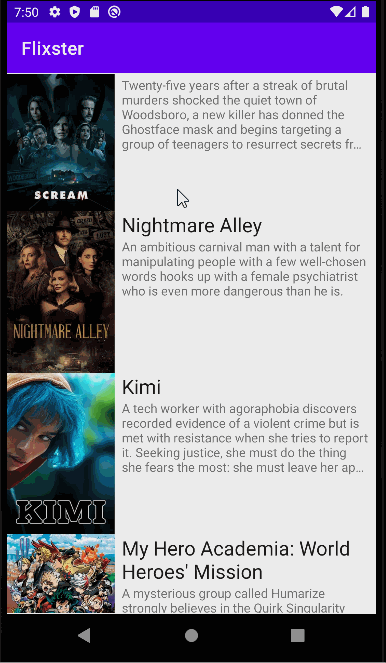

# Flix
Flix is an app that allows users to browse movies from the [The Movie Database API](http://docs.themoviedb.apiary.io/#).

Submitted by: **Christy Xiong**

Time spent: **10** hours spent in total

## Flix Part 1

### User Stories

The following **required** functionality is completed:

#### REQUIRED (10pts)
- [x] (10pts) User can view a list of movies (title, poster image, and overview) currently playing in theaters from the Movie Database API.
### App Walkthough GIF

 

### Notes
Some challenges that I had when creating this program was getting the emulator to cooperate with Andriod Studios because I ran into errors where my app would not run within the emulator. 

### Open-source libraries used

- [Android Async HTTP](https://github.com/codepath/CPAsyncHttpClient) - Simple asynchronous HTTP requests with JSON parsing
- [Glide](https://github.com/bumptech/glide) - Image loading and caching library for Androids
